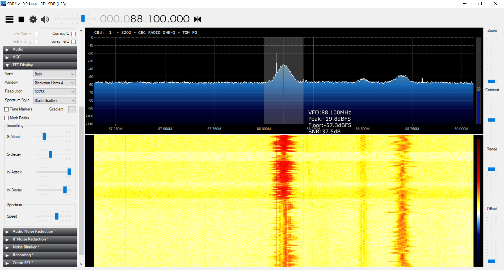
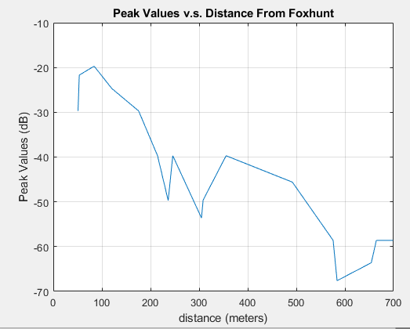

\vspace*{\fill}

Performed: May 10th, 2019

Due: May 23rd, 2019

Authorship:

- Arick Grootveld
  - Introduction
  - Discussion
  - Conclusion
  - References
- Tristan Smith
  - Experimental Design
  - Results
  - Abstract

\thispagestyle{empty}
\clearpage
\setcounter{page}{1}

\section*{Abstract}
This document outlines a procedure to qualitatively measure radio frequency (RF) signals in the real world, and to increase intuition when working with antennas and radio receivers.
In these experiments, we use an affordable software defined radio (SDR) to tune in to public radio stations as far away as Vancouver, BC, as well as pick up public service bands used by emergency workers.
Finally, we used the receiver to locate a hidden transmitter on campus.

# Equipment and Parts

* RTL-SDR USB Receiver
* Whip Antenna
* SDR Sharp Software
* Map
* Hidden Transmitter

# Introduction
Wireless Communication is a large part of the modern world, from cellphones to routers, more and more technology is moving to RF communication.
How these RF signals travel through the world was the primary focus of this lab, with emphasis on determining what it takes to receive digital and analog signals.
Factors like distance, multipath, signal strength, bandwidth, and signal-to-noise ratio (SNR) all play key roles in deciding how you can communicate.
Higher SNR means you can pack more levels of signals into a signal, more bandwidth means you can get more bits into every second of transmission.
Higher SNR in our case came from increasing the amount of received power that we were getting, as the noise power is dependent on your gain settings and hardware specifications.

Electromagnetic signals traverse media by creating changing electric and magnetic fields.
These fields have particular properties that can have a large influence on how much power you are receiving.
The first property that can heavily influence how much received power you are getting is distance from transmitter to receiver, since for an isotropic receiver and transmitter you are radiating equal power out in all directions, the power of the signal is equally spread out over the surface of a sphere, which leads to a squared power loss over a distance.
This means that if you were to go twice as far from the transmitter as you had been, you should receive four times less power. 
One other component that effects the received power of your signal is the multipath of the signals propagation. 
Multipath happens when a signal bounces off of a piece of terrain like a building, but still finds it's way to the receiver.
This can cause distortions in the signal, as you get either constructive or destructive interference based on the phase change introduced by the different amounts of time that the two signals take to reach the receiver. The attentuation can get even worse when you do not have Line of Sight (LOS) to the transmitter because this means that you are relying on multipath signals to get your message to the receiver.

Antenna polarization is another subject that is important to radio transmission, because it can heavily effect the received power.
Antenna polarization is the orientation of the antenna with respect to the wave.
Because Electromagnetic waves can either travel horizontally or vertically, if your antenna is not oriented in the same direction you will not be giving the signal its full potential to travel down your antenna, and therefore limit the amount of power that you can receive.  

\newpage
# Experimental Design

## Tuning In To FM Radio \label{design-fm-radio}
First, we used our SDR receiver to tune in to an FM radio station.
We adjusted the RF gain of the device to 19.7dB, and set the sample rate to 2.4 megasamples per second.
We selected the "WFM" option to enable wide-band FM, then listened in at 88.1MHz.
Terry O'Reilly, of CBC/2's Under the Influence joined us for the duration of our measurements.

## Antenna Placement and Orientation\label{design-orientation}
Next, we developed a strategy for measuring received power.
We noticed that the relative power shown in the spectrum viewer varied widely over time, so we turned the decay of the spectrum up to about 50%.
With a higher decay, we saw a more consistently shaped spectrum over a window of time.

You will observe two main shapes: a rounded triangular shape, and a rectangular shape.
In the case of the rectangular shape, we measured both the width and height, and compute the area to measure received power.
In the case of the rounded triangular shape, we reflected that a triangular shape in logarithmic scale is very close to an impulse in linear scale.
So, we recorded the peak value, which was at the center frequency for each transmitter.

We also recorded estimates of the signal-to-noise ratio, and noticed that antenna orientation had a large effect on the relative received power of the signal.

## Effect of RF Gain
Again, we tuned to 88.1MHz CBC/2 (Under the Influence, with Terry O'Reilly), and measured the following as we adjusted the RF gain of the SDR:

- Noise Floor
- SNR
- Relative Received Power

## Received Power Measurements of FM Radio Stations\label{design-fm}
Next, we developed a method to measure the relative received power of FM radio stations.
First, we turned up the "S-Decay" on our spectrogram viewer.
This allowed us to smooth out the changes in power due to volume changes in the audio being transmitted.
As a result of this smoothing, we developed two strategies of measurement based on the two shapes mentioned in Section \ref{design-orientation}.
As discussed in Section \ref{design-orientation}, for rectangular frequency content (Section \ref{design-digital}), we measured the width and height.
For rounded triangular frequency content, we measured the peak value.
We measured the relative received power of three different stations, and recorded the following details for each:

- Call Letters
- Frequency
- Distance from Campus
- Relative Receive Power
- Effective Radiated Power (ERP)

Effective radiated power, call letters, and distance from campus were all sourced from radio-locator.com \cite{radio-locator}.

## Received Power Measurements of Digital FM Radio Stations\label{design-digital}
We repeated the procedure in Section \ref{design-fm} but for the digital transmissions located in the adjacent bands to some analog radio stations.

## Public Service Frequencies
There are also several frequency bands used by the government and public service organizations.
We switched our SDR's demodulation settings to narrowband FM (NFM) to match public service handheld transmitters.
We also turned the "squelch" setting up to silence the noise during periods of silence.
We recorded the following details:

- Frequencies
- Public service names
- relative received power

## Foxhunting and Path-Loss Modeling\label{exp-fox}
Finally, we used the method of measuring relative received power previously developed to locate a hidden transmitter on campus.
We switched our SDR back to wide-band FM, and tuned into 146.565MHz.
We took periodic measurements of the signal's strength around campus, and walked in the direction of increasing received power.
We recorded ten points on a map as we searched for the transmitter, and more measurements in close range of the transmitter once we were extremely close to it.

\newpage
# Results

## FM Radio
After adjusting our SDR as specified in Section \ref{design-fm-radio}, we picked up a station at 150.7MHz (Table \ref{fm}).
Then, we tuned in to Western Washington University KUGS, as shown in Figure \ref{kugs}.
We found that there were many random spikes that occurred around our band of interest. 

Table: Tuning In To an FM Radio Station \label{fm}

| Property | Value |
| ---- | --------- |
| Band (MHz) | 150.7 |
| Gain (dB) | 19.7 |
| Sample Rate (Msps) | 2.4 |
| Tuner AGC | OFF |

After a few songs, we measured the noise floor (Table \ref{kugs-table}).

Table: Tuning in to KUGS \label{kugs-table}

| Property | Value |
| --- | --- |
| Noise Floor (dB) | -57 |

## Antenna Placement and Orientation

Next, we observed the effect of antenna orientation on the relative received power and the noise floor (Figures \ref{angle1}, \ref{angle2}, \ref{angle3}).
As a part of these measurements, we noticed several sources of noise. There were several bands containing sharp spikes of interference.
One of these spikes can be seen clearly in Figure \ref{angle1}.
The noise floor was dependent on our location and direction as well.
By moving the antenna, we were able to increase our SNR drastically, or even decrease it to almost zero (Figure \ref{angle3}).

By touching the antenna, we were actually able to increase the SNR (Figures \ref{touch}, \ref{no-touch}).

## Effect of RF Gain

Still tuned in to KUGS, we adjusted the RF gain and measured the corresponding noise floor and peak relative received power.
Using this data, we could calculate the SNR (Equation (@snrdb)).
The most useable range of SNR without clipping was around 20dB to 30dB (Table \ref{rfgain}).

(@snrdb) $$ SNR_dB = Peak_dB - Noise Floor_dB $$

Table: Effect of RF Gain, Measured at 88.1MHz \label{rfgain}

| Gain (dB) | Noise Floor (dB) | Peak (dB) | SNR (dB) |
| --------- | ---------------- | --------- | -------- |
| 19.7 | -56 | -25 | 31 |
| 0 | -56 | -42 | 14 |
| 49.6 | -35 | 5 (clipping) | 40 |
| 29.7 | -50 | -12 | 38 |

## Received Power Measurements of FM Radio Stations

Next, we measured the relative received power of three analog FM radio stations, as described in Section \ref{design-fm}.
We recorded the details of each station in Table \ref{t-fm}.

\begin{table}[h]
	\centering
	\caption{Relative Received Power of Three Analog FM Radio Stations}
	\label{t-fm}
	
	\begin{tabularx}{\textwidth}{X X X X X}
		\hline
		Frequency (MHz) & Call Sign & Distance (mi) 
		& Measured Relative Received Power (dBFS) & Radiated Power (dBW) \\ \hline 

		88.1 & CBU/2 & 46.8 & -22dB & 97.6 \\
		89.3 & KUGS & 1.0 & -30 & 0.95 \\
		91.7 & KZAZ & 3.8 & -45 & 0.12 \\ [1ex] \hline
	
	\end{tabularx}
\end{table}

## Received Power Measurements of Digital FM Radio Stations
We also measured the relative received power of three digital FM radio stations (Table \ref{results-digital}).
We performed this measurement by finding the height (power at middle of rectangle) of each rectangular frequency content band and then measuring the width of the rectangle in MHz.
Then, we converted the width to a decibel scale and added the two values.
This is the equivalent of multiplying on the linear scale, which would give us the area of the rectangle. 

$$ Width (dB) = 20*log_{10}(Width (Hz)) $$

We estimated that the area of each rectangle was the total power transmitted in that signal. 

$$ Area = Height (dB) + Width (db) $$

\begin{table}[H]
	\centering
  	\caption{Relative Received Power of Three Digital FM Radio Stations}
  	\label{results-digital}
	\begin{tabularx}{\textwidth}{X X X X X X}
		\hline
		Frequency (MHz) & Call Sign & Distance (mi) & Height x Width (dB x MHz)
		& Measured Relative Received Power (dBFS) & Radiated Power (dBW) \\ \hline 
		
		92.9 & KISM & 16.7 & -35 x 0.075 & 62.5 & 94.0 \\
		103.5 & CHQM & 46.9 & -38.5 x 0.125 & 63.4  & 100   \\
		104.1 & KAFE & 16.7 & -54 x 0.070 & 42.9 & 95.6 \\ [1ex] \hline
	\end{tabularx}
\end{table}

## Public Service Frequencies
We were only able to find and measure the public service frequencies sporadically.
We zoomed out, and saw intermittent signals at the two frequencies in Table \ref{table-pub}.
The 453.225MHz band was active enough to identify as a police band, but we were unable to guess what communication was occurring at the 453.55MHz band.

Table: Public Service Frequencies\label{table-pub}

| Frequency (MHz) | Public Service | Relative Received Power (dB) | RF Gain (dB) |
| --- | --- | --- | --- |
| 453.225 | Police | -5 | 12.7 |
| 453.55 | Unknown | Not Recorded | 12.5 |

## Foxhunting and Path-Loss Modeling

Finally, we measured the relative received power of the signal specified in Section \ref{exp-fox}, and tracked down the hidden transmitter across campus.
We started out in the wrong direction, and saw extremely low received power with high gain (Table \ref{table-fox}).
Eventually, we were close enough to the transmitter to pick up the signal with a relative received power of -19.7dB (Table \ref{table-fox}).
The locations from Column 1 of Table \ref{table-fox} are listed on the map in Figure \ref{signalMap}.

Since we adjusted the RF gain of the SDR throughout our measurements, we had to compensate for the gain in our recorded observations.
We computed the "actual peak" relative received power by subtracting the frontend gain from our measurements.

(@actual) $$ Actual Peak_{dB} = Peak_{dB} - RF Gain_{dB} $$

Table: Foxhunt Relative Received Power\label{table-fox}

| Location (num) | Distance (m) | Peak (dB) | RF Gain (dB) | Actual Peak (dB) |
| --- | --- | --- | --- | --- |
|  1 |  575.7   |   - 20.0 |   38.6   |   - 58.6 | 
|  2 |  664.7   |   - 20.0 |   38.6   |   - 58.6 | 
|  3 |  698.9   |   - 25.0 |   38.6   |   - 63.6 | 
|  4 |  654.2   |   - 29.0 |   38.6   |   - 67.6 | 
|  5 |  583.8   |   - 20.0 |   38.6   |   - 58.6 | 
|  6 |  491.8   |   - 15.0 |   38.6   |   - 53.6 | 
|  7 |  355.5   |   - 11.0 |   38.6   |   - 49.6 | 
|  8 |  308.3   |   - 7.0  |   38.6   |   - 45.6 | 
|  9 |  214.5   |   - 20.0 |   19.7   |   - 39.7 | 
| 10 |  236.4   |   - 20.0 |   19.7   |   - 39.7 | 
| 11 |  304.9   |   - 30.0 |   19.7   |   - 49.7 | 
| 12 |  245.8   |   - 20.0 |   19.7   |   - 39.7 | 
| 13 |  175.5   |   - 10.0 |   19.7   |   - 29.7 | 
| 14 |  120.4   |   - 10.0 |   19.7   |   - 29.7 | 
| 15 |   84.0   |   - 5.0  |   19.7   |   - 24.7 | 
| 16 |   50.9   |   - 2.0  |   19.7   |   - 21.7 | 
| 17 |   53.4   |     0.0  |   19.7   |   - 19.7 | 

With these results, we plotted the signal strength versus the distance from the transmitter (Figure \ref{plot-rx-distance}).

\begin{figure}
	\centering
	\includegraphics{./WWUCampusMapWithMarkers.PNG}
	\caption{Foxhunt Measurement Locations Map}
	\label{signalMap}
\end{figure}

\newpage
# Discussion

## FM Radio 
In \ref{design-fm-radio} we began to measure signals from external sources.
We started out by receiving from KUGS, the wideband FM radio signal which came through extremely clearly in our audio tests. 
The other radio stations were much harder tune into, but this probably had something to do with our ability to navigate the application we were using. 

## Antenna Placement and Orientation
In \ref{design-orientation} we found that turning the decay up to about 50% was the most effective way to estimate power, because this performed more averaging on the signal.
This gave us a better picture of the signals average power over time. 
The small spikes we saw in our spectrum were most likely from other radio stations or transmitters that were around our target frequency, as well as reflections from buildings and geography. In Figure \ref{angle1} you can see a narrow band interferer that probably came from another transmitter, because the peak value is far too high to be multipath from off of a building.   

We also found that measuring the peak value of the non-square signals was the best way to estimate their power, because the peak value was where the majority of the power was concentrated. 
This may not be apparent from the figures shown, but that is because they are on a logarithmic scale, whereas on a linear scale the center peak would be many times larger than any of the side-lobes.

This would not work for a rectangular pulse shape, however, because the rectangle has a constant height, which means that the power is distributed over the whole band.
This means that we needed to take the total area of the rectangles to get the power of the signal. This required us to convert the frequency spectrum to a dB scale and then add the width and height to get the power of the signal.

We found that the effect of antenna orientation was significant when trying to pick up signals. This is because of the polarization of the travelling waves.
If our antenna matched the polarization of the transmitted signal then we would see additional power received. 
In addition to our experiments with antenna polarization, we also found that touching the antenna improved our signal strength at certain frequencies (Figure \ref{touch} and Figure \ref{no-touch}). This was most likely due to the fact that our antenna was not the correct length to receive at these specific frequencies, and our bodies were actually more apt antennas corresponding to the particular wavelengths.  

## Effect of RF Gain
In this section of the lab we fiddled with the RF gain quite a bit in order to test the effect it had on several parameters.
We found that the noise floor did not get changed much when we increased the gain, with a gain in the range of 0 to 30 keeping the noise floor around the -50 dB range.
However when we increased our gain up to the maximum it could go to, we found that the noise floor was actually significantly increased.
But increasing the gain corresponded with an increase in the noise floor level. 

We believe that the non-linear noise floor must be highly related to the hardware itself, since the noise floor does not scale very heavily with the gain, meaning that a large portion of the noise must be being introduced after the gain stage, which could only happen inside the hardware.
If we were to take any two data points with different gains, and get the noise floor at each of those points, we would be able to estimate the noise introduced by the hardware by subtracting one value from the other, and then dividing by the gain adjustment that we made.
The noise difference value would likely be the portion of the noise that is actually introduced by the RF spectrum (if we assume the amplifier is completely linear). 

Because the noise is not as correlated to the gain as the power is, increasing the RF gain increased the SNR of our signal by a very large amount.
The only real limitation to increasing the RF gain all the way up was that it would introduce clipping in our signal, which is a non-linearity that we do not want introduced into our signal.
Too small of a gain could mean that our SNR was not high enough for us to distinguish our signal from noise.

A good SNR value that we found was somewhere between 20 and 30 dB, because this meant that we would not see clipping, but still have our noise be relatively low compared to the signal.
But because the noise floor was so much lower than the signals we were looking at (Table \ref{rfgain}), really any gain above 10 and below 40 would probably have worked. 

## Received Power Measurements of FM Radio Stations
We measured the relative received power from the FM stations by tuning into the specific frequency and then grabbing a peak.
We then used the peak value of the FM broadcast signal to approximate the power of the signal, for reasons stated earlier. 
We found that some of the received power values did not correspond with transmit towers in the way that we expected, with the received power corresponding inversely with distance to the transmitter, and corresponding positively with the amount of radiated power.

## Received Power Measurements of Digital FM Radio Stations
When measuring the digital FM spectrum we had to convert the frequency spectrum into a dB scale in order to calculate the total power, because we needed to have like units to multiply the peak power by the width of the signal.
We converted the width in Hz to dB because we wanted the total power in dB, which would be an easy conversion if we simply stuck to dB for both portions of the signal.

## Public Service Frequencies
In this section we used the SDR to scan public service frequencies that did not have nearly as wide of a spectrum as the FM radio stations.
We found that the signals present on the public service frequencies did not use up nearly as much bandwidth, which is probably why the audio quality was so much worse.
It makes sense that the emergency numbers would not need as much bandwidth, because they do not care about the quality of their transmissions. 
The static that we heard on the channel is probably a good indicator that the public service bands are mostly analog. 
We did not hear much traffic on these frequencies, because these bands are not licensed off to the general public, and are protected so that those that can transmit on them can guarantee their messages will get through. 

## Foxhunting and Path-Loss Modeling
The relative received powers that we got were about what we would expect given the theory stated earlier. As the graph in Figure \ref{plot-rx-distance} shows the signal got weaker the further away from the transmitter we got. 
There are a few data points that show places where we actually got better received power the further we got from the transmitter, but this is just a fluke in our data collection process, as we did get some measurements behind buildings that might have caused these anomalous measurements due to multipath and loss of LOS. At some points we had to adjust the RF gain so that we were not saturating, which goes to show the magnitude of change that happens over distance. 	

\newpage
# Conclusion
This lab gave us the opportunity to learn how RF signals propagate through the air. 
It was also an excellent opportunity to learn about the different frequency bands, and how they are used. 
We saw both digital and analog signals using our SDR, which gives us a better idea of what those types of communication will look like in the future, as well as their strengths and weaknesses. 
We also were able to perform many different measurements with relative received power, under many differing circumstances. 
We were able to test how antenna orientation, distance, and line of sight effected the relative received power. 
We were also able to adjust several digital parameters and determine their effects on the SNR and signal strength. Because of the SDR program that we were running, we saw how different power levels in signals showed up on the spectrum, and learned how to estimate relative received power based on the shape of the signal itself. 
The lab served as an introduction to RF transmission in an interesting and novel way. 

\newpage

\begin{thebibliography}{2}

\bibitem{Lab Handout}
A. Klein. "Lab 4: Measuring Received Signal Power" Western Washington University, Spring 2019.

\bibitem{radio-locator}
"Radio Locator,” Radio. [Online]. Available: https://radio-locator.com/. Theodric Technologies LLC. [Accessed: 22-May-2019].

\end{thebibliography}
